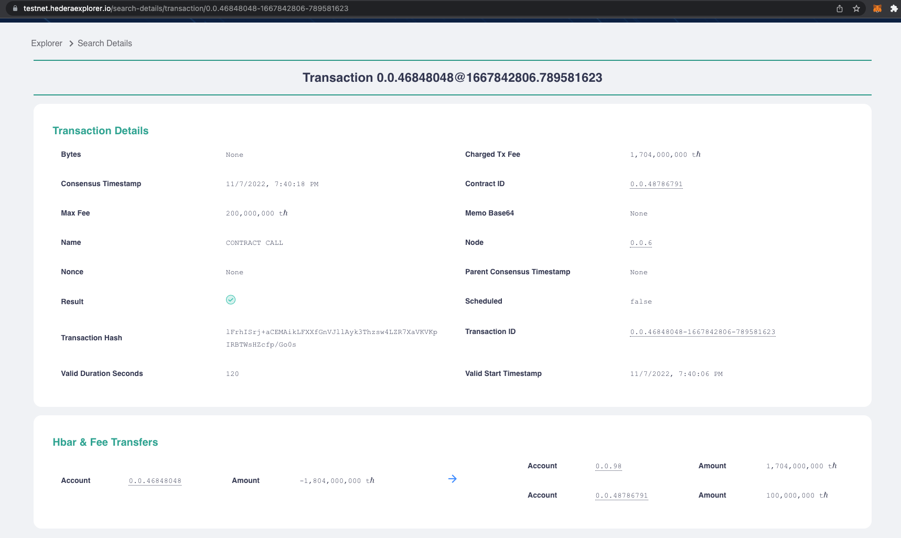
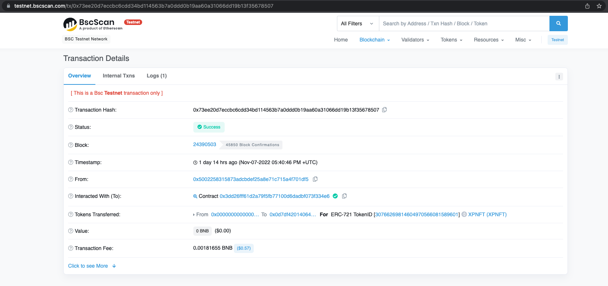
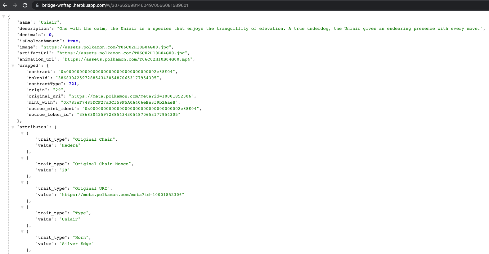
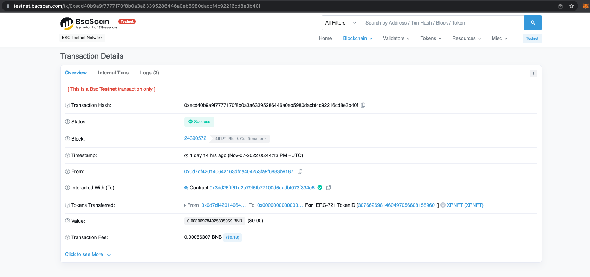
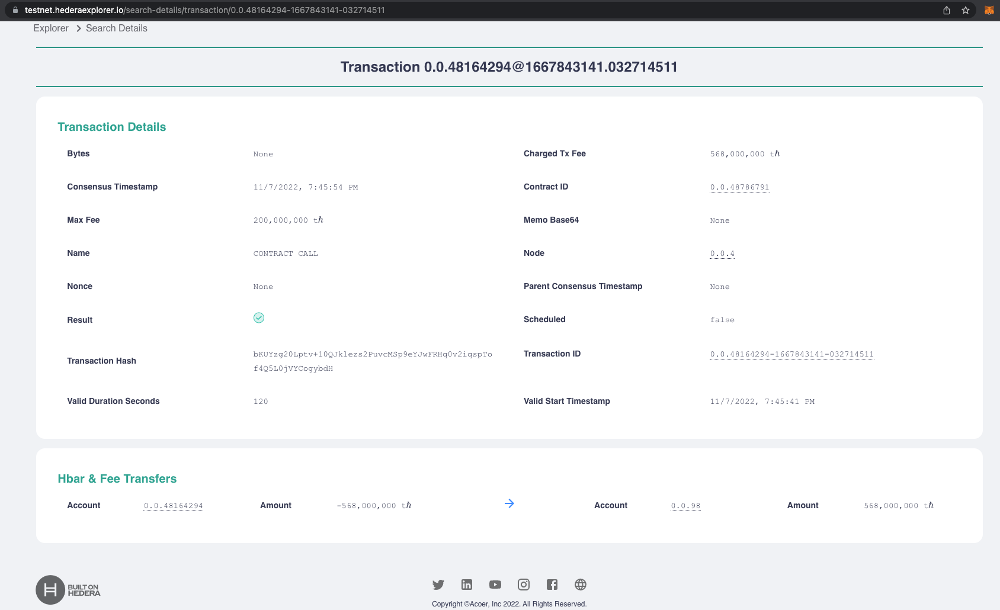

# `Milestone 3` — Testing, Fixing Bugs & Documenting

1. We have provided a basic [tutorial](https://github.com/XP-NETWORK/testing-hedera) that can interact with the deployed smart contracts and backend service.
2. We've [testing](#a-transferring-hedera---bsc) the contracts in the testnet environment, see below

## HTS Protocol integration

Even though it was not discussed before the grant started, to be completely compatible with Hedera, we have implemented support for HTS. The project testing HTS can be found here: https://github.com/XP-NETWORK/testing-hedera

### A. Transferring Hedera -> BSC:

A.1 From Hedera: https://testnet.hederaexplorer.io/search-details/transaction/0.0.46848048-1667842806-789581623

A.2 To BSC: https://testnet.bscscan.com/tx/0x73ee20d7eccbc6cdd34bd114563b7a0ddd0b19aa60a31066dd19b13f35678507

Wrapped Metadata: https://bridge-wnftapi.herokuapp.com/w/30766269814604970566081589601

### B. Transferring BSC - Hedera:

B.1 From BSC: https://testnet.bscscan.com/tx/0xecd40b9a9f7777170f8b0a3a63395286446a0eb5980dacbf4c92216cd8e3b40f

B.2 To Hedera: https://hashscan.io/testnet/transactionsById/0.0.48164294-1667843141-032714511

