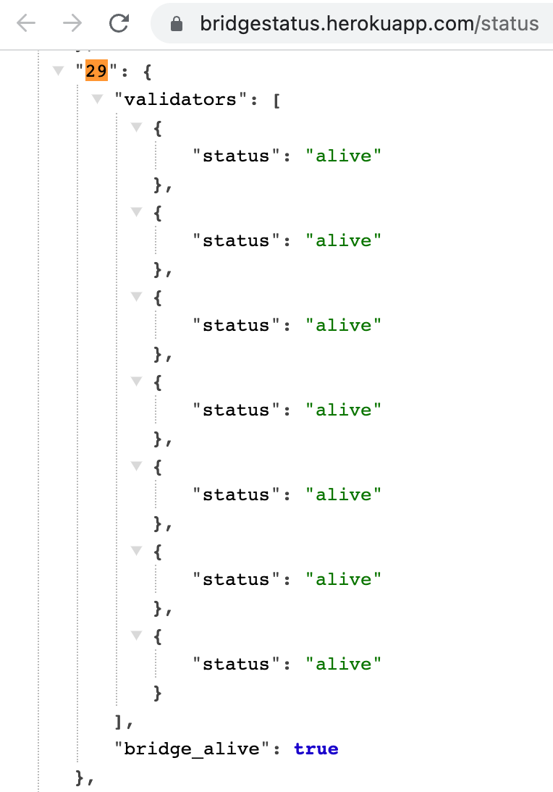

# Milestone 4 delivery proofs

## 1. Mainnet contracts

|#|Name|Role|
|:-:|:-:|:-:|
|1|[Bridge](https://hashscan.io/mainnet/contract/0.0.2992290)|Orchestrates the work of NFT contracts. Communicates with the validators|
|2|[HTSToken](https://hashscan.io/mainnet/token/0.0.2994905)|Implements Hedera Token Service contract|
|3|[HTSClaims](https://hashscan.io/mainnet/contract/0.0.2994904)|Claims the NFT from the HTS token contract|

## 2. Mainnet wallets integration


## 3. NFT Indexer

NFT Indexer fetches the owned NFTs by a user account. The bridge UI provides the list of a user owned NFTs displaying every item as NFT cards.


API requests can be used to retrieve the user NFTs. Example: 

```url title="GET"
https://nft-index.xp.network/index/nfts/29/00000000000000000000000000000000001e9348
```
Example response:


## 4. Mainnet validators

Successful work of the bridge validators can only be estimated by the speed of the relayed transactions on the chain of origin and destination.

|NFT Direction|Outgoing Transaction|Incomming Transaction|Cross-chain operation|
|:-:|:-:|:-:|:-:|
|Hedera->Moonbeam|[11:24:06.4403 AMJun 27, 2023 UTC+3](https://hashscan.io/mainnet/transaction/0.0.2003784-1687854234-108988679)|[Jun-27-2023 08:24:30 AM +UTC](https://moonscan.io/tx/0x1685f7c5dd1a94797a22e4f2a163b23916e8363a35909b6a87f8204224f49f05)| 24 seconds|
|BSC->Hedera|[Jun-26-2023 11:42:28 AM +UTC](https://bscscan.com/tx/0xc26246511dfc16eeb352034e3de7d07a83effccf4187634620b9a32db61e110c)|[2:42:34.5408 PM Jun 26, 2023, GMT+3](https://hashscan.io/mainnet/transaction/0x61e2e1adfc0bc94ffd40ee6a50c7b215583b4f469948eb0db687286612a63e50970685ab8e1ee08f89d96753f1bf5a6a)|6 seconds|


## 5. Hertbeat Integration

This tool checks validator's liveliness every 10 seconds:

```
https://bridgestatus.herokuapp.com/status
```

|Icon|Blockchain|Bridge chain ID|Protocol|
|:-:|:-:|:-:|:-:|
 | Hedera|29|Semi-EVM|

 

 `bridge_alive` indicates that Hedera RPCs are responsive and the transactions can go through.

## 6. UI Integration

Hedera is available in the bridge UI as the chain of departure:


And the chain of destination:


## 7. Mainnet transactions

Mainnet transactions can be found in the Bridge Explorer: https://explorer.xp.network/

To filter transactions sent FROM Hedera: https://explorer.xp.network/search?chainName=HEDERA


To filter transactions TO Hedera: https://explorer.xp.network/search?toChainName=HEDERA

