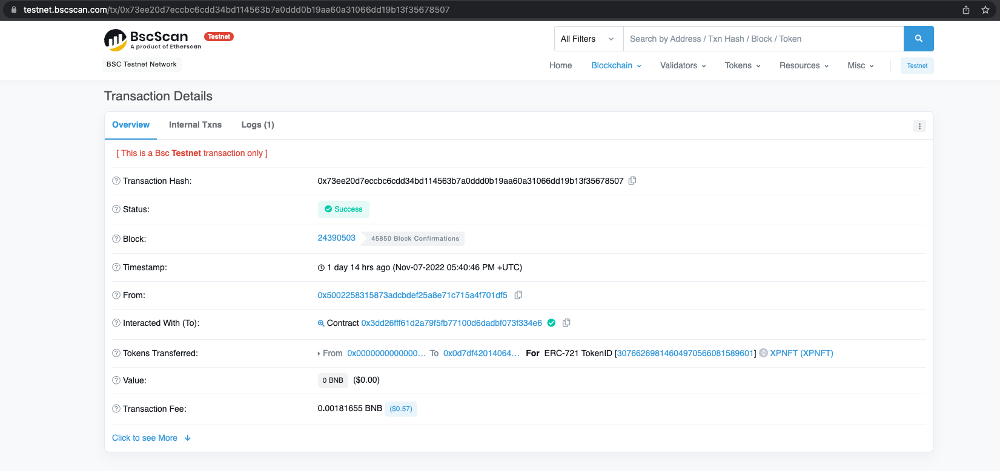
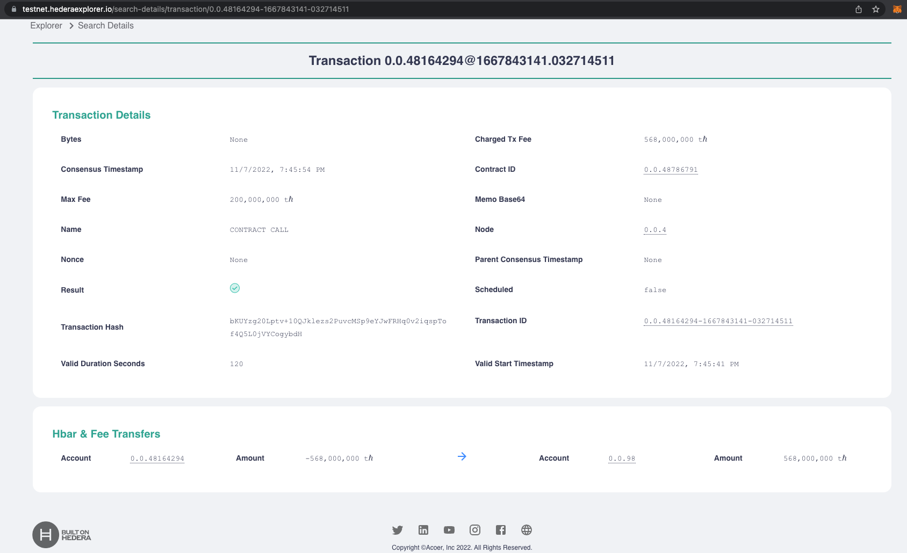

# DONE

## `Milestone 1` — Smart Contract Development & Deployment

Length - 1 week - DONE

0. Research about Hedera standards and other factors & [protocols](https://docs.hedera.com/guides/core-concepts/smart-contracts/supported-erc-token-standards) that distinguish it from other chains 
We will develop smart contracts that will:

1. [Add](https://github.com/XP-NETWORK/XP.network-HECO-Migration/blob/f474704150da557f931e011026d0c033b391bd7a/dist/Minter.d.ts#L221-L223) / [Remove](https://github.com/XP-NETWORK/XP.network-HECO-Migration/blob/f474704150da557f931e011026d0c033b391bd7a/dist/Minter.d.ts#L227-L229) a validator
2. [Freeze](https://github.com/XP-NETWORK/XP.network-HECO-Migration/blob/f474704150da557f931e011026d0c033b391bd7a/dist/Minter.d.ts#L164)/[Unfreeze](https://github.com/XP-NETWORK/XP.network-HECO-Migration/blob/dist/dist/Minter.d.ts#L239-L244) Native NFTs
3. [Mint](https://github.com/XP-NETWORK/XP.network-HECO-Migration/blob/dist/dist/Minter.d.ts#L186-L188)/[Burn](https://github.com/XP-NETWORK/XP.network-HECO-Migration/blob/dist/dist/Minter.d.ts#L257-L259) wrapped NFTs
4. [Withdraw](https://github.com/XP-NETWORK/XP.network-HECO-Migration/blob/dist/dist/Minter.d.ts#L198-L200) the TX fees on the target chain in native tokens
5. [Trust](https://github.com/XP-NETWORK/web3-contracts/blob/erc1155/contracts/Minter.sol#L86-L119) the multisig of the bridge oracle validators
6. [Whitelist](https://github.com/XP-NETWORK/XP.network-HECO-Migration/blob/dist/dist/Minter.d.ts#L333-L335) NFT smart contracts
7. [Pause](https://github.com/XP-NETWORK/XP.network-HECO-Migration/blob/dist/dist/Minter.d.ts#L224-L226)/[Unpause](https://github.com/XP-NETWORK/XP.network-HECO-Migration/blob/dist/dist/Minter.d.ts#L245-L247) for maintenance or if compromised
8. [Reimburse](https://github.com/XP-NETWORK/XP.network-HECO-Migration/blob/dist/dist/Minter.d.ts#L201-L203) the bridge validators their expenses

***

## `Milestone 2` — Integrating into the Live Bridge
Length - 3 weeks

1. Developing validation logic relevant for the Hedera part of the bridge
2. Deploying smart contracts to the testnet - see below:
   1. Bridge: https://hashscan.io/#/testnet/contract/0.0.47756643
   2. erc1155Minter: https://hashscan.io/#/testnet/contract/0.0.47756597
   3. Default-ERC-1155: https://hashscan.io/#/testnet/contract/0.0.47756624
   4. ERC-721-Minter: https://hashscan.io/#/testnet/contract/0.0.47756586
   5. Default-ERC-721: https://hashscan.io/#/testnet/contract/0.0.47756610
3. Adding Hedera to the bridge [JS library](https://github.com/XP-NETWORK/xpjs/search?q=hedera)
4. Integrating with a [Hedera gas fee estimation](https://github.com/XP-NETWORK/xpjs/blob/baa6255425a037f3865ff49e694d6e48a08399f7/src/helpers/web3.ts#L93-L95)
5. Integrating Hedera in [TX fee estimation](https://github.com/XP-NETWORK/xpjs/blob/secretjs/src/consts.ts#L397-L404)
6. Accessing [Hedera Testnet RPC](https://github.com/XP-NETWORK/xpjs/blob/baa6255425a037f3865ff49e694d6e48a08399f7/src/factory/factories.ts#L258)

***

## `Milestone 3` — Testing, Fixing Bugs & Documenting
Length - 1 week 

1. We have provided a basic [tutorial](https://github.com/XP-NETWORK/testing-hedera) that can interact with the deployed smart contracts and backend service.
2. We've [testing](#a-transferring-hedera---bsc) the contracts in the testnet environment, see below

## HTS Protocol integration

Even though it was not discussed before the grant started, to be completely compatible with Hedera, we have implemented support for HTS. The project testing HTS can be found here: https://github.com/XP-NETWORK/testing-hedera

### A. Transferring Hedera -> BSC:

A.1 From Hedera: https://testnet.hederaexplorer.io/search-details/transaction/0.0.46848048-1667842806-789581623

A.2 To BSC: https://testnet.bscscan.com/tx/0x73ee20d7eccbc6cdd34bd114563b7a0ddd0b19aa60a31066dd19b13f35678507

Wrapped Metadata: https://bridge-wnftapi.herokuapp.com/w/30766269814604970566081589601

### B. Transferring BSC - Hedera:

B.1 From BSC: https://testnet.bscscan.com/tx/0xecd40b9a9f7777170f8b0a3a63395286446a0eb5980dacbf4c92216cd8e3b40f

B.2 To Hedera: https://hashscan.io/testnet/transactionsById/0.0.48164294-1667843141-032714511

***

# TODO:

## `Milestone 4` — Mainnet Integration & Deployment
Length - 1 week 

1. Deploying the contracts in the Mainnet environment
2. Integrating the mainnet Wallet
3. Integrating the mainnet NFT-Indexer
4. Integrating the mainnet validators
5. Plugging Hedera in the heartbeat
6. Adding Hedera to the Bridge NFT-Indexer
7. Integrating Hedera in the bridge UI
8. Testing the Integrated Hedera in the mainnet